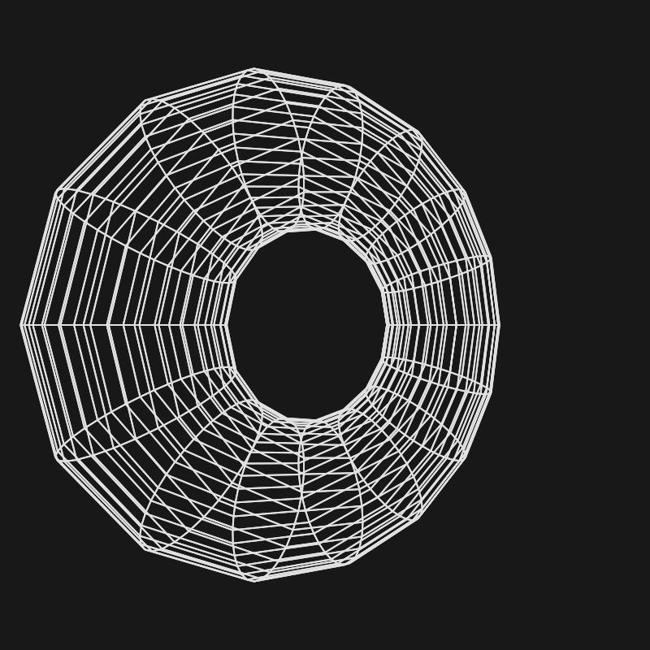

# 3D Engine From Scratch

A minimal 3D rendering engine built from scratch using vanilla JavaScript and HTML5 Canvas. This project demonstrates the fundamental mathematics behind 3D graphics without relying on any external libraries like Three.js or WebGL.



## Overview

This engine implements core 3D graphics concepts including 3D-to-2D projection, rotation transformations, and wireframe rendering. It renders a rotating torus (donut shape) in real-time using only the 2D Canvas API.

## Features

- **Pure JavaScript**: No dependencies or external libraries
- **3D Projection**: Implements perspective projection (x/z, y/z formula)
- **3D Rotation**: Y-axis rotation using rotation matrices
- **Wireframe Rendering**: Draws edges connecting 3D vertices
- **Real-time Animation**: 60 FPS rendering with smooth rotation
- **Torus Model**: Pre-generated torus geometry with 12 radial and 12 tubular segments

## How It Works

The engine follows a classic 3D graphics pipeline:

1. **3D Model Definition**: Vertices (VS) define points in 3D space, Faces (FS) connect vertices
2. **Rotation Transform**: Applies rotation matrix to rotate points around Y-axis
3. **Z-Offset**: Moves the object away from the camera (viewer's eye)
4. **Perspective Projection**: Projects 3D coordinates (x,y,z) to 2D using division by z-depth
5. **Screen Mapping**: Converts normalized coordinates (-1 to 1) to screen pixels
6. **Rendering**: Draws lines between projected points using Canvas API

## Running the Project

Simply open `index.html` in any modern web browser. No build process or server required.

```bash
# Option 1: Open directly
open index.html

# Option 2: Use a simple HTTP server
python -m http.server 8000
# Then navigate to http://localhost:8000
```

## Technical Details

- **Canvas Size**: 800x800 pixels
- **Frame Rate**: 60 FPS
- **Rotation Speed**: π/2 radians (90°) per second
- **Projection**: Simple perspective projection without near/far clipping planes
- **Color Scheme**: Dark background (#181818) with light wireframe (#e1e1e1)

## Code Structure

- `index.html`: Minimal HTML with canvas element
- `index.js`: Complete 3D engine implementation
  - Torus geometry data (VS, FS)
  - Transformation functions (rotateY, project, screen)
  - Rendering pipeline (clear, line, frame)

## Learning Value

This project is ideal for understanding:
- How 3D graphics work at a fundamental level
- The mathematics behind perspective projection
- Rotation matrices and coordinate transformations
- Animation loops and frame timing
- Working with the Canvas 2D API

## License

This is an educational project demonstrating 3D rendering fundamentals.
